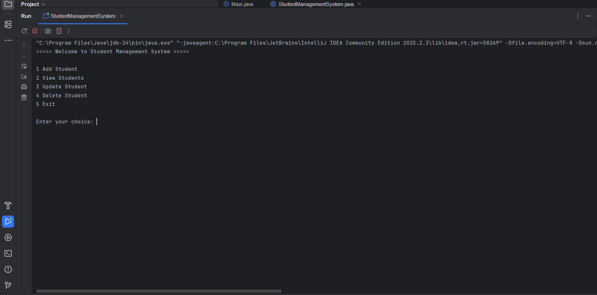
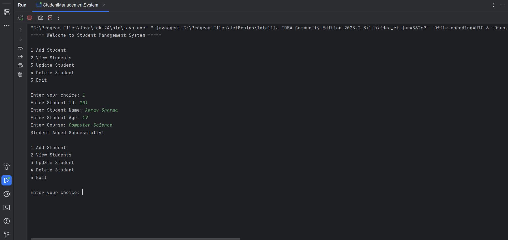
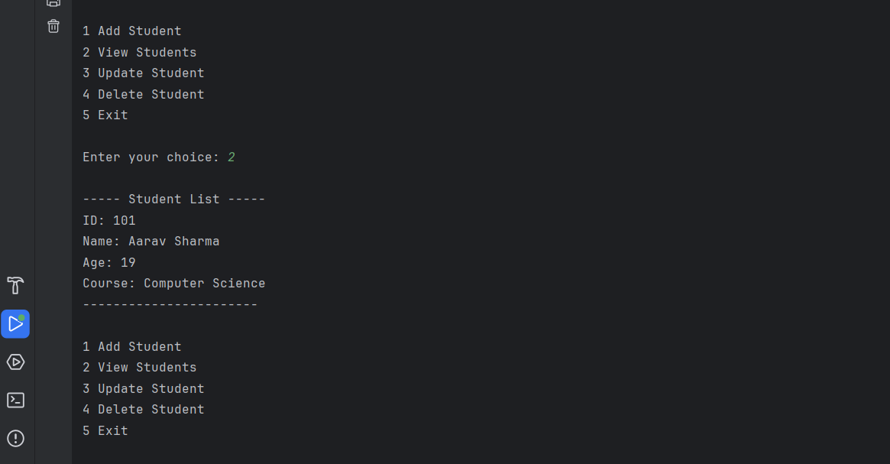
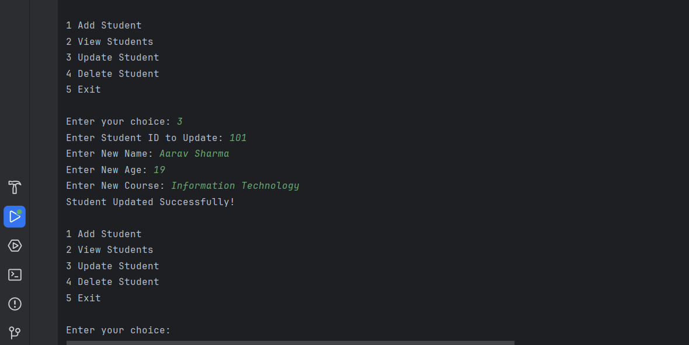
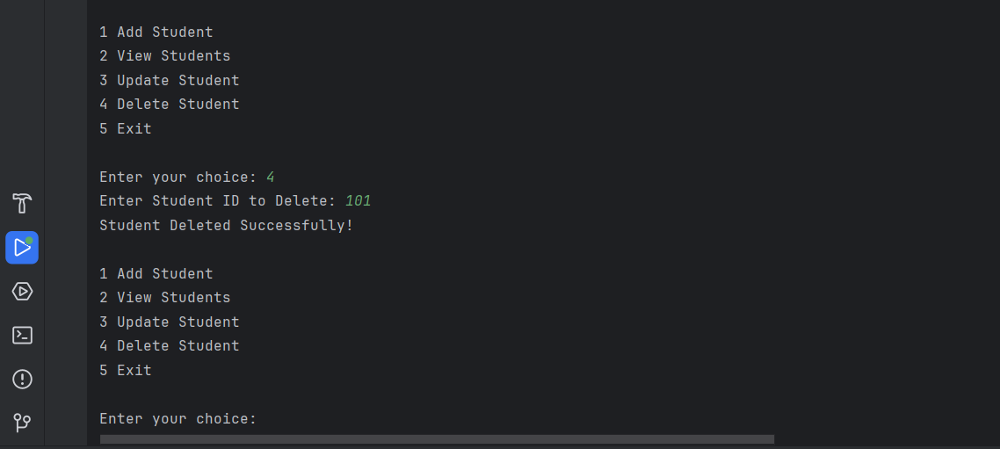

# 🎓 Student Management System

<div align="center">

# 📚 Student Management System

### Console-Based CRUD Application built using Core Java

<p align="center">


</p>

</div>

---

# 📖 Overview

Student Management System is a **Console-Based Java Application** developed using **Core Java** to demonstrate CRUD (Create, Read, Update and Delete) operations.

The project follows Object-Oriented Programming principles and stores student information in memory using **ArrayList**. It provides a simple menu-driven interface that allows users to manage student records efficiently through the command line.

This project was built to strengthen Core Java fundamentals and prepare for backend development with Spring Boot.

---

# ✨ Features

## 👨‍🎓 Student Management

- Add Student
- View All Students
- Update Student Details
- Delete Student

---

## 📋 Student Information

- Student ID
- Student Name
- Student Age
- Student Course

---

## ⚙️ Application Features

- Console-Based Interface
- Menu Driven Navigation
- CRUD Operations
- ArrayList Data Storage
- Object-Oriented Programming
- Simple User Interaction using Scanner

---

# 🛠 Tech Stack

| Technology | Used |
|------------|------|
| Java 21 | ✅ |
| Core Java | ✅ |
| OOP | ✅ |
| ArrayList | ✅ |
| Scanner | ✅ |
| IntelliJ IDEA | ✅ |

---

# 🧩 Project Structure

```text
src/
└── com/
    └── jeevan/
        └── student/
            ├── Student.java
            └── StudentManagementSystem.java
```

---

# 🚀 Application Workflow

```
Start Application

       │

       ▼

Display Main Menu

       │

       ▼

Select Operation

       │

 ┌─────┼───────────────┐
 │     │               │
 ▼     ▼               ▼

Add   View          Update

       │

       ▼

Delete

       │

       ▼

Exit
```

---

# 🚀 Getting Started

## 1️⃣ Clone Repository

```bash
git clone https://github.com/jeevan-kaware/student-management-system-java.git
```

```bash
cd student-management-system-java
```

---

## 2️⃣ Open Project

Open the project using:

- IntelliJ IDEA
- Eclipse
- Visual Studio Code

---

## 3️⃣ Run Application

Run

```text
StudentManagementSystem.java
```

The application will start with the console menu.
---

# 📋 Functionalities

## ➕ Add Student

Allows the user to add a new student by entering:

- Student ID
- Student Name
- Student Age
- Student Course

The student is stored in memory using **ArrayList**.

---

## 📖 View All Students

Displays all available student records.

Information displayed:

- Student ID
- Student Name
- Student Age
- Student Course

---

## ✏️ Update Student

Allows updating an existing student's information using the Student ID.

Editable fields:

- Student Name
- Student Age
- Student Course

---

## ❌ Delete Student

Deletes a student record using the Student ID.

Displays confirmation after successful deletion.

---

## 🚪 Exit Application

Safely terminates the application.

---

# 📸 Application Screenshots

The following screenshots demonstrate the working of the application.

---

## 🏠 Main Menu

Displays the available operations.



---

## ➕ Add Student

Adding a new student record.



---

## 📖 View Students

Displaying all student records.



---

## ✏️ Update Student

Updating an existing student.



---

## ❌ Delete Student

Deleting a student record.



---

# 🧠 Core Java Concepts Used

This project demonstrates practical implementation of:

- Classes & Objects
- Constructors
- Encapsulation
- Object-Oriented Programming (OOP)
- ArrayList Collection Framework
- CRUD Operations
- Loops
- Conditional Statements
- Scanner Class
- Menu-Driven Programming
- Method Creation
- User Input Handling

---

# 📈 Learning Outcomes

Through this project, I gained hands-on experience with:

- Core Java Programming
- Object-Oriented Programming
- Collection Framework (ArrayList)
- CRUD Application Development
- Java Methods
- Classes & Objects
- Constructor Usage
- User Input Handling
- Menu Driven Console Applications
- Problem Solving
- Java Coding Best Practices

---

# 🚀 Future Improvements

The following enhancements can be added in future versions:

- 💾 File Handling for Persistent Storage
- 🗄 JDBC Integration
- 🐘 PostgreSQL Database Integration
- 🔍 Search Student by ID
- 🔍 Search Student by Name
- 📄 Export Student Records
- ✅ Input Validation
- ⚠ Exception Handling
- 🖥 JavaFX GUI Version
- 🌐 Spring Boot REST API Version
- 📊 Admin Dashboard
- 🔐 Login Authentication

---

# 💡 Why This Project?

This project was built to strengthen Core Java fundamentals before moving to enterprise backend development using Spring Boot.

It demonstrates the ability to design a structured application using Object-Oriented Programming principles while implementing complete CRUD operations without relying on a database.

The project serves as a strong foundation for advanced Java technologies such as JDBC, Hibernate, and Spring Boot.

---
# 📄 Repository

GitHub Repository

https://github.com/jeevan-kaware/student-management-system-java

---

# 🤝 Contributing

Contributions, suggestions, and improvements are always welcome.

If you'd like to improve this project:

1. Fork this repository
2. Create a new feature branch

```bash
git checkout -b feature-name
```

3. Commit your changes

```bash
git commit -m "Added new feature"
```

4. Push to your branch

```bash
git push origin feature-name
```

5. Create a Pull Request

---

# 🏆 Project Highlights

✔ Console-Based Application

✔ Core Java Project

✔ Object-Oriented Programming

✔ CRUD Operations

✔ Collection Framework

✔ Menu Driven Interface

✔ Beginner Friendly

✔ Backend Foundation Project

---

# 📚 Ideal For Learning

This project is suitable for developers who want to learn:

- Java Basics
- OOP Concepts
- Collections Framework
- CRUD Logic
- Console Applications
- Backend Programming Fundamentals

It also serves as an excellent foundation before learning:

- JDBC
- Hibernate
- Spring Boot
- REST APIs
- PostgreSQL

---

# 👨‍💻 Author

## Jeevan Kaware

**Aspiring Java Backend Developer**

Passionate about building secure, scalable, and production-ready backend applications using Java, Spring Boot, PostgreSQL, Spring Security, REST APIs, and modern software development practices.

---

### 🌐 Portfolio

https://smart-portfolio-kappa-eight.vercel.app/

---

### 💼 LinkedIn

https://www.linkedin.com/in/jeevan-kaware-080643355/

---

### 💻 GitHub

https://github.com/jeevan-kaware

---

### 📂 Repository

https://github.com/jeevan-kaware/student-management-system-java

---

# 🚀 Next Version

Future versions of this project may include:

- JDBC Integration
- Hibernate ORM
- Spring Boot REST API
- MySQL / PostgreSQL
- Authentication
- Spring Security
- Docker
- Railway Deployment
- Swagger Documentation
- React Frontend
- Full Stack Version

---

# ⭐ Support

If you found this project useful,

please consider giving this repository a ⭐.

It motivates me to build more high-quality Java and Spring Boot projects.

---

<div align="center">

# ❤️ Thank You

### Thank you for visiting this repository.

⭐ Don't forget to Star this repository if you liked it.

🚀 Happy Coding!

</div>
